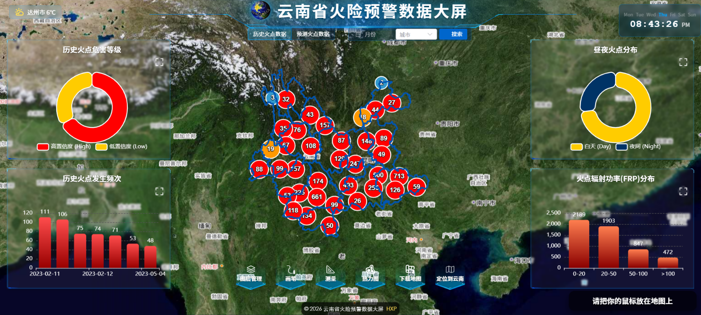
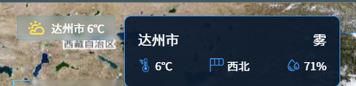
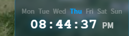
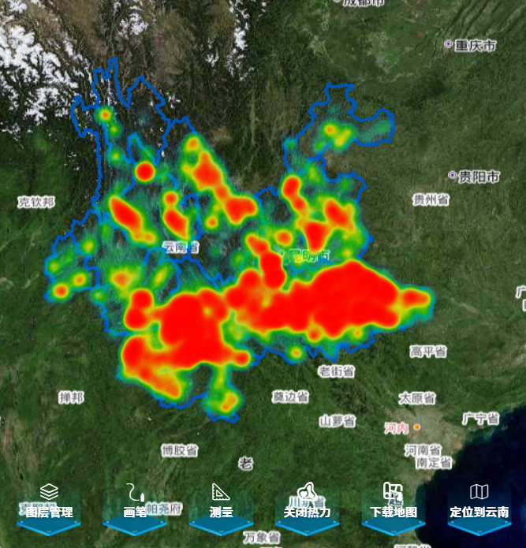
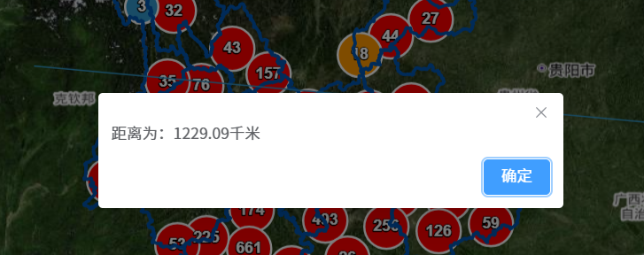
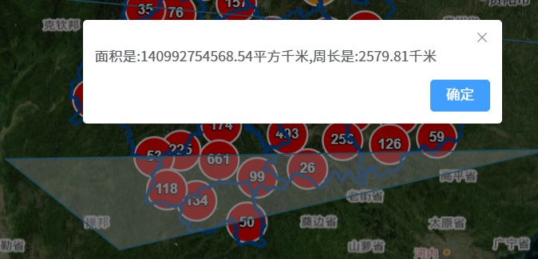
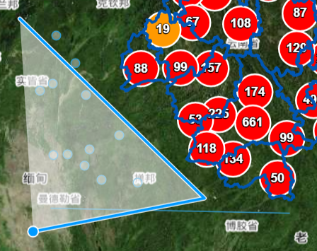
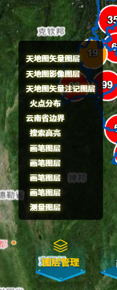
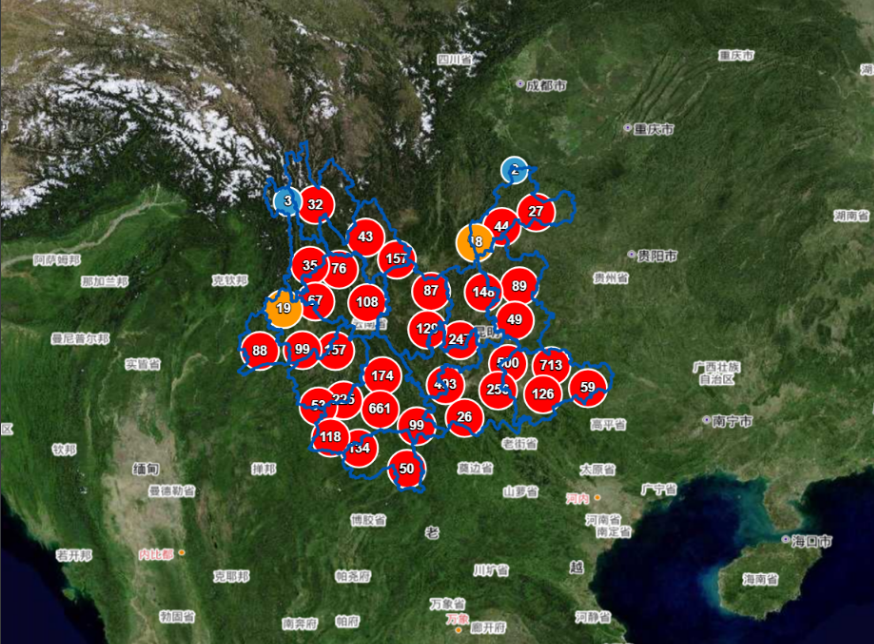
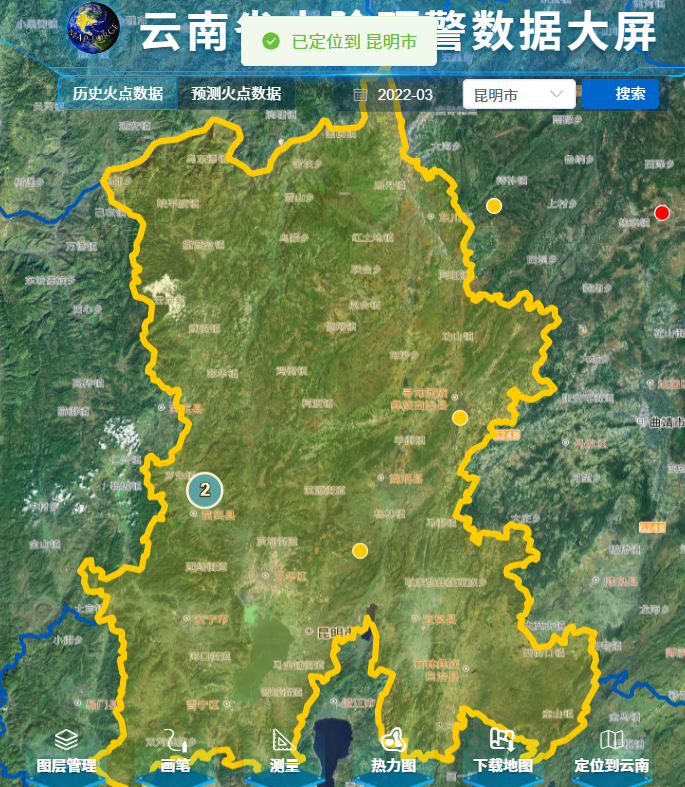

# 云南省火险可视化大屏 🌲🔥

#### 介绍

**"看火不是火，是数据在跳舞"** 

​		注：本项目为本人的毕设，现在还未做完，未集成预测的数据

​		这是一个基于Vue3 + OpenLayers的森林火险可视化大屏项目，专门为云南这块"动植物王国"量身打造。不仅能让火险数据"看得见"，还能让火势预测"算得准"，让防火决策"搞得定"！

​		项目融合了地理信息系统(GIS)、大数据可视化和火险预警模型，为云南省森林防火工作提供了一套"黑科技"解决方案。通过实时监测、智能预警、可视化展示，让火险管理从"被动救火"变成"主动防火"。

#### 项目效果速览

**主页效果**



**天气组件效果**



**时间组件效果**



**热力图效果**



**测量工具效果**





**画笔工具效果**



**图层管理工具效果**



**定位到云南工具效果**


**下载地图工具效果**



**由于4个chart组件都差不多，我就展示一个**

**组件效果**


**点击火点圆圈信息展示效果**


**筛选特定火点效果**



#### 软件架构

**技术栈：**

- **前端框架**：Vue3（响应式比云南的天气变化还快）
- **地图引擎**：OpenLayers（地图界的"老司机"）
- **图表库**：ECharts（数据界的"画家"）
- **UI组件**：ElementPlus（颜值担当）
- **数据格式**：GeoJSON（地理数据的"通用语言"）

**系统架构：**
- 前端：Vue3单页面应用(SPA)
- 地图服务：OpenLayers + 高德地图API
- 数据可视化：ECharts图表库
- 数据存储：本地GeoJSON文件 + 在线API

#### 安装教程

**"三步走"战略，让你快速上手：**

1. **克隆项目**（把代码"拐"回家）
   ```bash
   git https://gitee.com/wjl2004/Fire_hazard_Yunnan_system.git
   cd Fire_hazard_Yunnan_system
   ```

2. **安装依赖**（给项目"喂饱饭"）
   ```bash
   npm install
   ```
   
3. **启动项目**（让项目"跑起来"）
   ```bash
   npm run dev
   ```

**环境要求：**

- Node.js >= 22.11.0（老版本请"退休"）
- npm >= 10.9.0
- 现代浏览器（IE请"走开"）

#### 使用说明

**"傻瓜式"操作指南：**

1. **查看火险等级分布**
   - 打开地图，五颜六色的区域就是火险等级
   - 蓝色=较低（可以"散步"）
   - 黄色=中等（需要"注意"）
   - 红色=极高（需要"紧张"）
2. **使用图层控制**
   - 点击图层管理按钮，像"开关灯"一样控制图层显示
   - 可以叠加多个矢量图等
3. **测量工具使用**
   - 测距：点击"测量距离"图标，丈量长度
   - 测面：点击"测量面积"图标，计算面积
4. **热力图分析**
   - 红色越亮，火险越高（"热点"地区）
   - 可以用来找"最危险"的区域
5. **详情查询**
   - 点击地图上的点位，弹出"八卦"窗口
   - 查看详细火险信息、历史数据

#### 参与贡献

**"众人拾柴火焰高"（虽然我们不希望真有火）：**

1. **Fork本仓库**（复制一份"你的地盘"）
2. **新建Feat_xxx分支**（开辟"新战场"）
3. **提交代码**（献上你的"智慧结晶"）
4. **新建Pull Request**（让我们"欣赏"你的杰作）

**贡献指南：**
- 代码风格：请保持"整洁如新"
- 提交信息：请写得"明明白白"
- 功能测试：请确保"稳如老狗"

#### 特技

**我们的"独门绝技"：**

1. **实时预警**：基于气象数据的火险预测模型，比"天气预报"还准（还未实现）
2. **智能推荐**：根据火险等级，支持"最佳应对策略"（还未实现）

**参考资源：**

- Gitee**[黄现鹏](https://gitee.com/huang-xianpeng6)/[2024四川地质灾害可视化平台](https://gitee.com/huang-xianpeng6/disaster_sichuan)**

---

**最后的话：**

这个项目不仅能让你"看懂"火险，更能让你"看透"火险。我们用代码为云南省的森林防火工作贡献一份力量，用技术守护这片绿色的家园。记住，预防胜于治疗，防火重于救火！

**"让数据多跑路，让防火人员少跑腿"** —— 这就是我们项目的初心和使命！ 🌲💚
